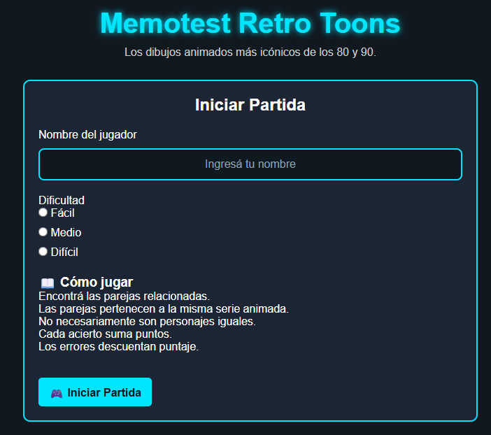
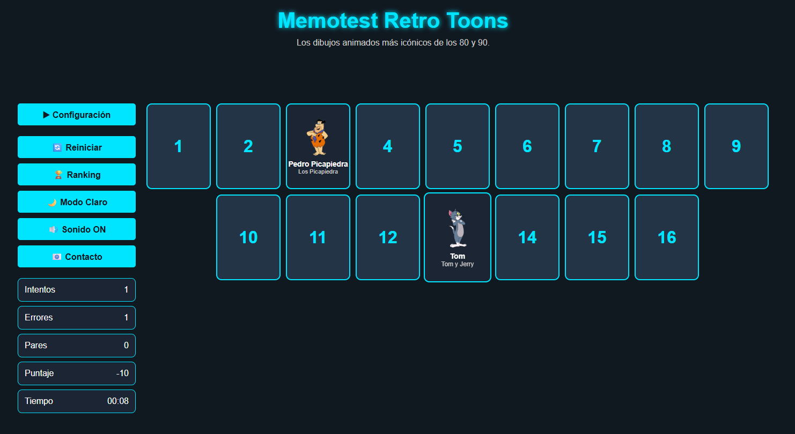
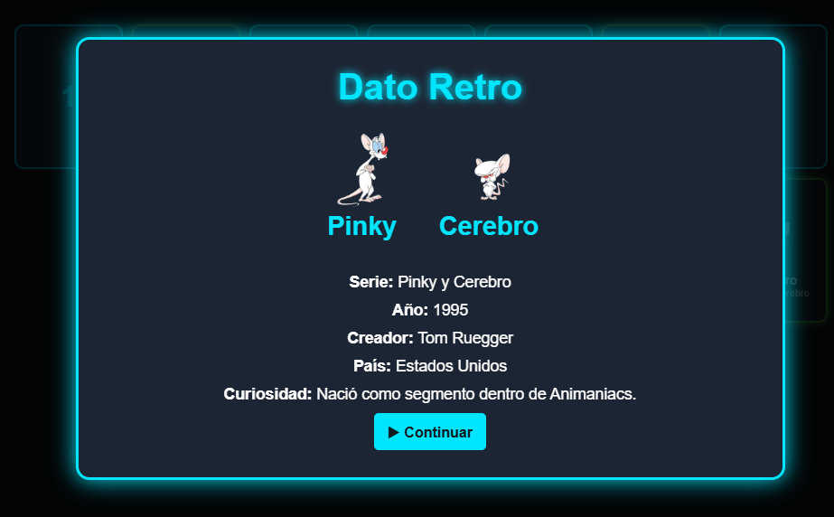
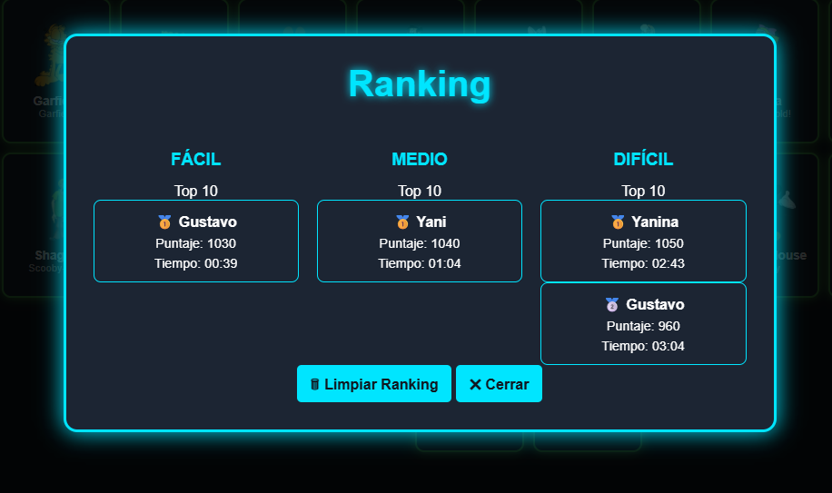
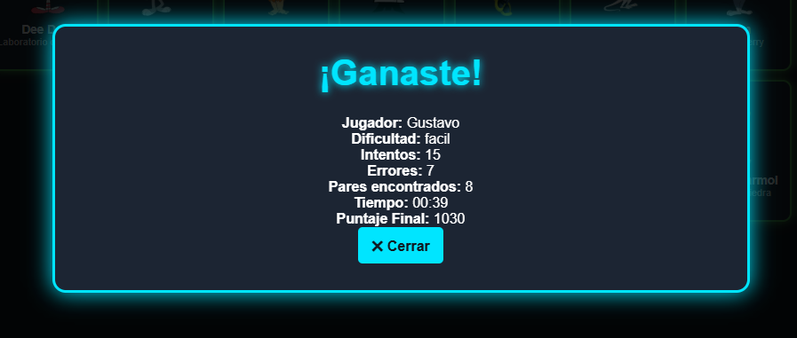

# 🎮 Memotest Retro Toons

Memotest Retro Toons es un juego de memoria desarrollado como Proyecto Final de Desarrollo y Arquitecturas Web (DAW).

El objetivo es encontrar todas las parejas de personajes animados clásicos de los años 80 y 90 utilizando la menor cantidad posible de intentos y en el menor tiempo.

---

## 🎨 Temática

El proyecto está inspirado en dibujos animados clásicos emitidos principalmente durante las décadas de 1980 y 1990.

Los personajes fueron seleccionados de series emblemáticas como:

- Tom y Jerry
- Scooby-Doo
- Looney Tunes
- Pinky y Cerebro
- Bob Esponja
- Thundercats
- Halcones Galácticos
- He-Man
- Tortugas Ninja
- Transformers
- Dragon Ball Z

La propuesta combina entretenimiento con contenido cultural mediante la sección de Datos Retro.

---

## ✨ Características

- ✅ Tres niveles de dificultad.
- ✅ Modo progresivo entre niveles.
- ✅ Sistema avanzado de puntaje.
- ✅ Temporizador de partida.
- ✅ Ranking persistente mediante LocalStorage.
- ✅ Datos Retro al descubrir parejas.
- ✅ Modo Claro / Oscuro.
- ✅ Sonido configurable.
- ✅ Formulario de contacto.
- ✅ Persistencia de preferencias de usuario.
- ✅ Diseño responsive para escritorio, tablet y dispositivos móviles.

---

## 📖 Reglas del juego

- Ingresá tu nombre y seleccioná una dificultad.
- Descubrí las cartas para encontrar las parejas correctas.
- Las parejas están formadas por personajes relacionados de una misma serie animada.
- Las parejas no necesariamente son personajes iguales (por ejemplo: Tom y Jerry).
- Cada pareja encontrada suma puntos.
- Los errores descuentan puntaje según la dificultad elegida.
- Al encontrar una pareja se mostrará un Dato Retro sobre la serie.
- Completá todas las parejas para ganar la partida.
- Intentá obtener el mejor puntaje y aparecer en el ranking.
- También es posible jugar en Modo Progresivo, avanzando automáticamente entre los niveles Fácil, Medio y Difícil.

---

## 📊 Niveles de dificultad

### Fácil
- 16 cartas
- 8 parejas

### Medio
- 20 cartas
- 10 parejas

### Difícil
- 36 cartas
- 18 parejas

---

## 🚀 Modo Progresivo

El jugador puede completar una campaña compuesta por:

- Fácil
- Medio
- Difícil

Al completar un nivel se accede automáticamente al siguiente.

Durante toda la partida se mantienen acumulados:

- Puntaje
- Intentos
- Errores
- Porcentaje de aciertos

Al finalizar cada nivel se muestra un resumen con las estadísticas obtenidas.

La partida finaliza al completar el nivel Difícil.

---

## 🏆 Sistema de Puntaje

### Puntaje Base

Cada pareja encontrada suma:

+100 puntos

### Penalización por error

| Dificultad | Penalización Base |
|------------|-------------|
| Fácil | -10 |
| Medio | -20 |
| Difícil | -30 |

### Bonus por Racha

Los aciertos consecutivos generan bonificaciones acumulativas.

Ejemplo:

- 2 aciertos seguidos → +20
- 3 aciertos seguidos → +40
- 4 aciertos seguidos → +60

### Penalización Progresiva

Los errores consecutivos incrementan la penalización aplicada según la dificultad seleccionada.

### Bonus por Velocidad

- Menos de 2 minutos → +300 puntos
- Menos de 4 minutos → +150 puntos

### Bonus por Eficiencia

Según el porcentaje de aciertos:

- 90% o más → +300 puntos
- 75% o más → +150 puntos

### Resultado Final

El puntaje final se calcula combinando:

- Puntaje base
- Bonus por racha
- Bonus por velocidad
- Bonus por eficiencia
- Penalizaciones acumuladas

---

## 📈 Ranking

El sistema almacena automáticamente las partidas utilizando LocalStorage.

El ranking se organiza por dificultad y muestra los 10 mejores resultados de cada categoría.

Mostrando:

- Nombre del jugador
- Puntaje
- Tiempo

Los tres primeros puestos se destacan con:

- 🥇 Primer puesto
- 🥈 Segundo puesto
- 🥉 Tercer puesto

---

## 🎨 Personalización

### Temas

- 🌙 Tema Oscuro
- ☀ Tema Claro

### Sonido

- 🔊 Sonido activo
- 🔇 Sonido desactivado

Las preferencias quedan almacenadas localmente.

---

## 📚 Datos Retro

Al descubrir una pareja correctamente se muestra información relacionada:

- Personajes encontrados.
- Serie animada.
- Año de estreno.
- Creadores.
- País de origen.
- Curiosidades históricas.

Esta funcionalidad busca reforzar la temática retro del proyecto.

---

## ✅ Funcionalidades implementadas

- Generación dinámica del tablero según dificultad.
- Validación de nombre y dificultad.
- Comparación automática de parejas.
- Sistema avanzado de puntaje.
- Modo progresivo entre niveles.
- Temporizador de partida.
- Ranking persistente con LocalStorage.
- Configuración colapsable.
- Modo claro y oscuro.
- Sonido configurable.
- Persistencia de preferencias del usuario.
- Datos Retro con información histórica.
- Modal de resultado final.
- Resumen de nivel completado.
- Página de contacto.
- Diseño responsive para escritorio, tablet y dispositivos móviles.

---

## 💻 Tecnologías utilizadas

- HTML5
- CSS3
- JavaScript (Vanilla JS)
- LocalStorage

---

## 📁 Estructura del proyecto

```text
ProyectoFinal_DAW_Memotest
│
├── assets
│   ├── img
│   └── sounds
│
├── css
│   ├── reset.css
│   └── estilos.css
│
├── docs
│   ├── dato-retro.png
│   ├── inicio.png
│   ├── juego.png
│   ├── ranking.png
│   └── resultado-final.png
│
├── js
│   ├── datos.js
│   ├── juego.js
│   ├── ranking.js
│   ├── tema.js
│   └── contacto.js
│
├── index.html
├── contacto.html
└── README.md
```

---
## 📸 Capturas de pantalla

### Pantalla inicial



### Partida en curso



### Datos Retro



### Ranking



### Resultado final



---

## 🚀 Ejecución

1. Clonar el repositorio.

```bash
git clone https://github.com/CarlosGustavoPerez/ProyectoFinal_DAW_Memotest.git
```

2. Abrir:

```text
index.html
```

en cualquier navegador moderno.

---

## 🔗 Repositorio

[Repositorio GitHub](https://github.com/CarlosGustavoPerez/ProyectoFinal_DAW_Memotest)

---

## 🌐 GitHub Pages

[GitHub Pages](https://carlosgustavoperez.github.io/ProyectoFinal_DAW_Memotest/)

---

## 👨‍💻 Autor

Carlos Gustavo Pérez

Proyecto Final – Desarrollo y Arquitecturas Web (DAW)
